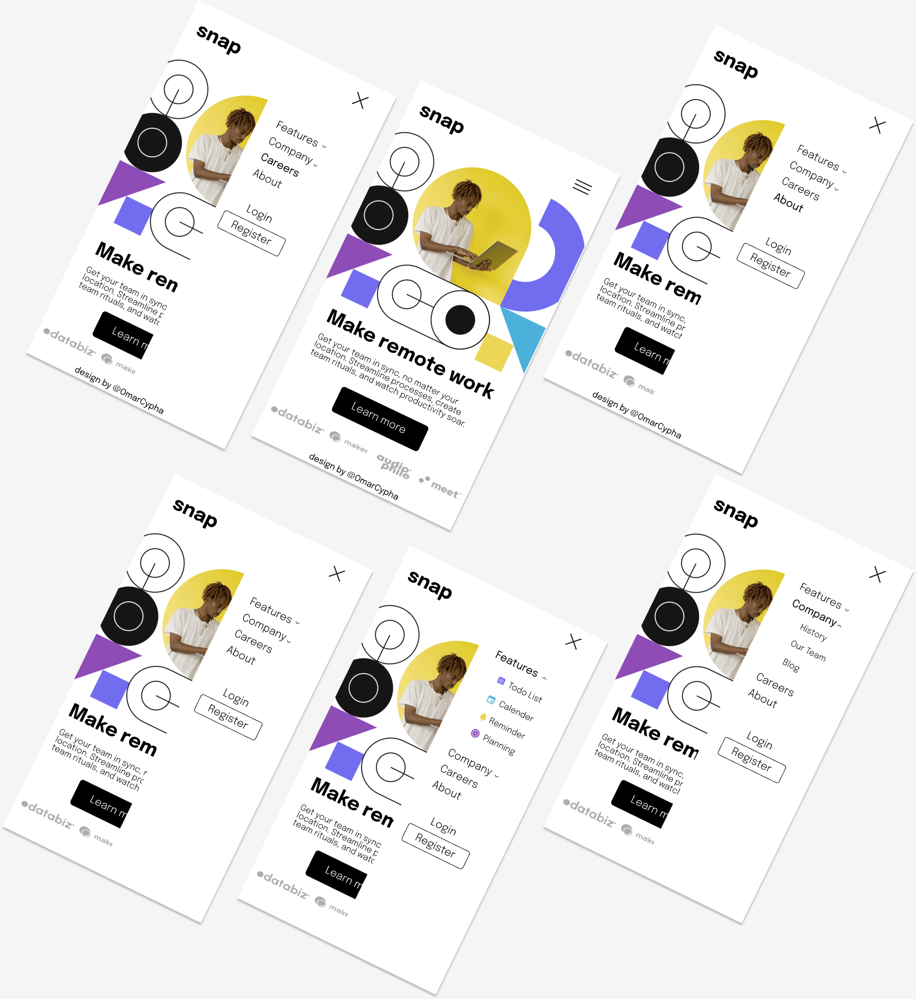

# Frontend Mentor - Intro section with dropdown navigation

## The Challenge 

### Mobile view

### Mobile view with mobile menu-collapsed

### Mobile view with mobile menu-expanded

## Desktop view 

## My Process
### Built with

- Semantic HTML5 markup
- CSS custom properties
- Basic javasript

## Deploying your project
This project was deployed with
- [Netlify](https://www.netlify.com/)

# Links
- [Live site](https://introsectioncypha.netlify.app/)

## Author

- Github - [@OmarCypha700](https://github.com/OmarCypha700)
- Frontend Mentor - [@OmarCypha700](https://www.frontendmentor.io/profile/yourusername)
- Twitter - [@OmarCypha](https://www.twitter.com/OmarCypha)

# Other Info
Redesigned the site with Figma with animation.
